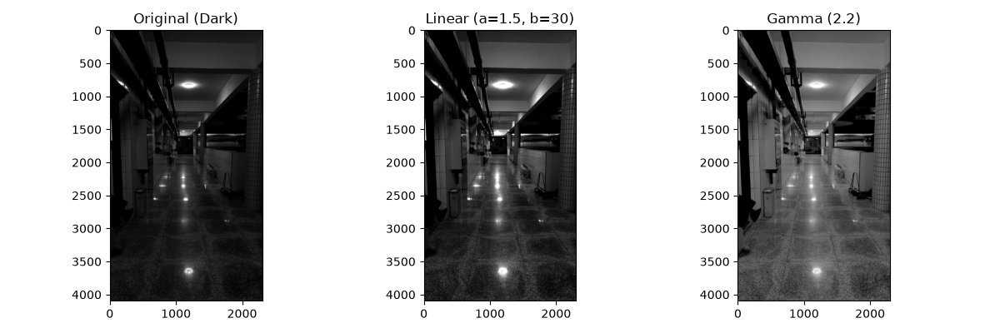
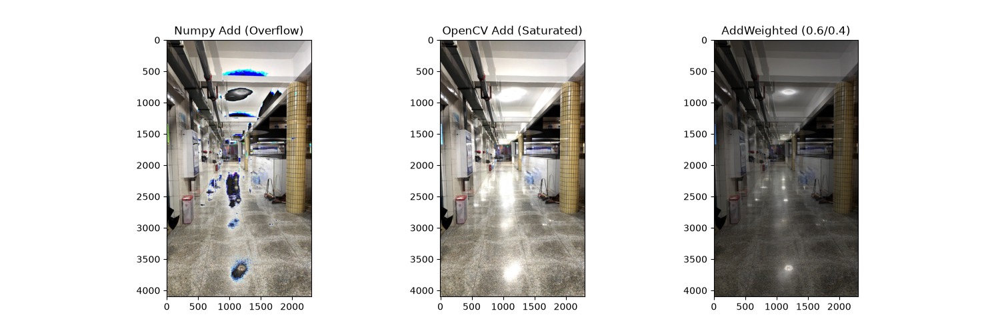
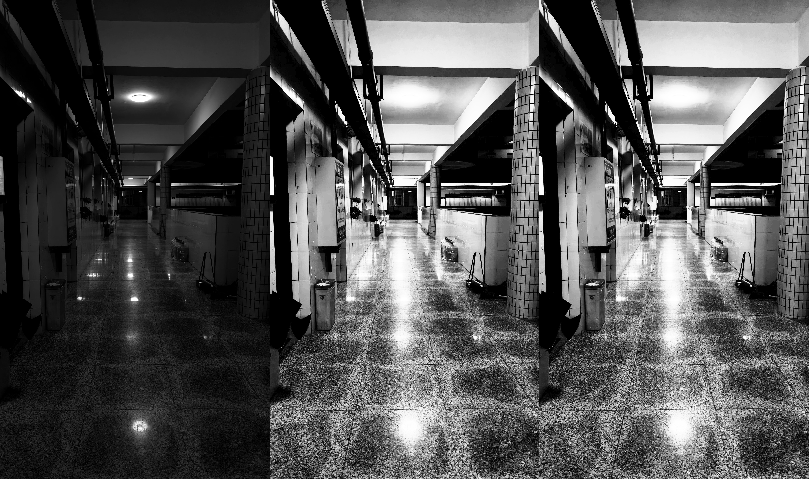
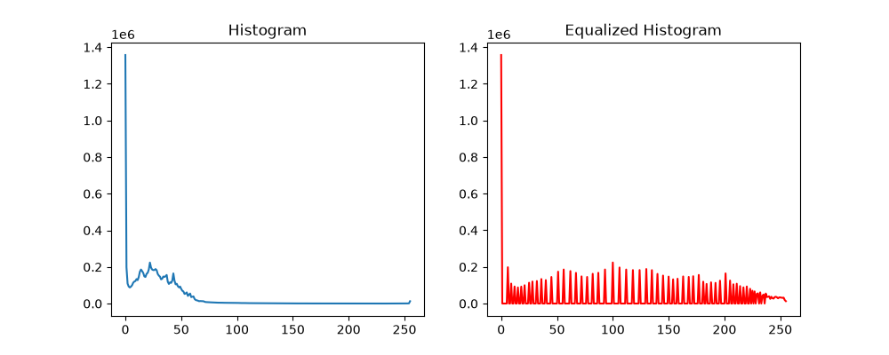
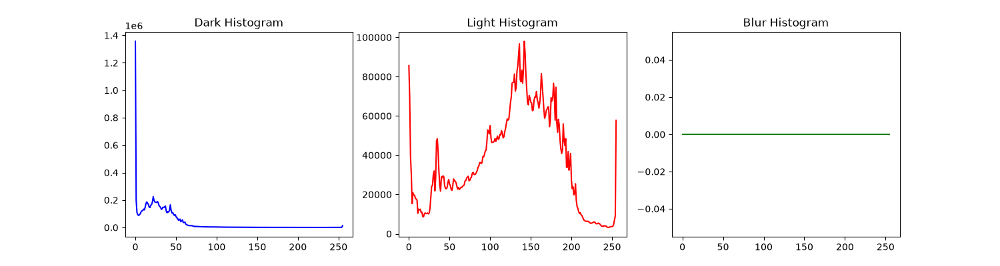
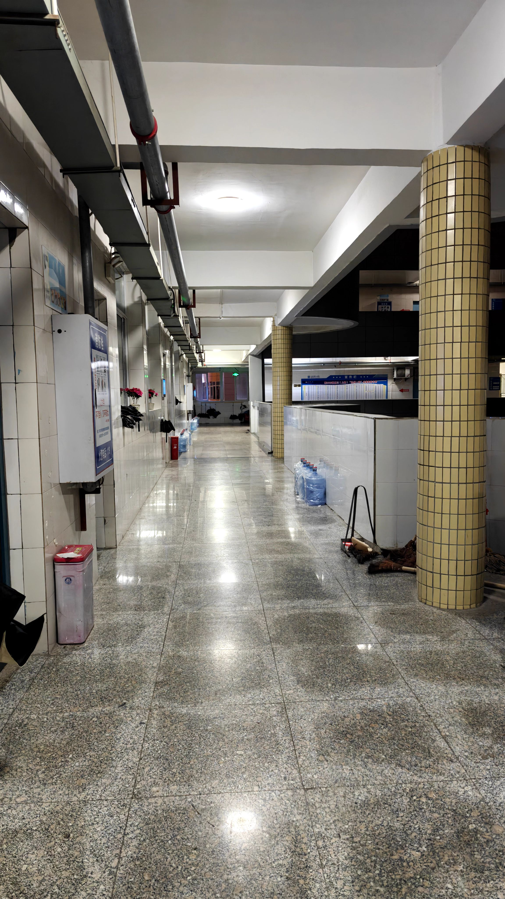
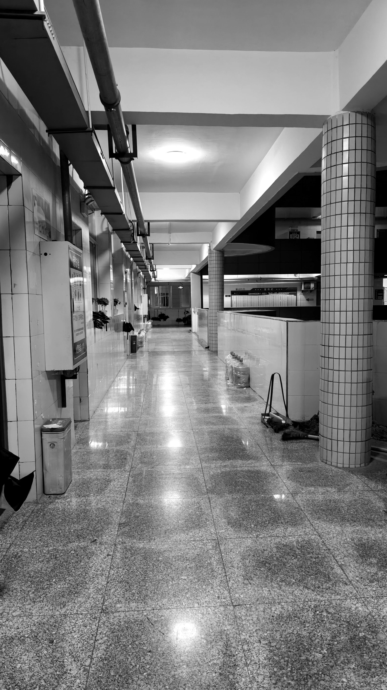

# 《动漫图形系统综合训练I》实验报告

**实验名称**：实验二 图像基本运算与直方图均衡化

## 实验目的

1. 掌握图像灰度的线性与非线性变换（伽马校正）原理与代码实现。
2. 理解 Numpy 加法与 OpenCV 代数运算的底层差异。
3. 深入理解直方图均衡化原理，完成手写 CDF 映射与 OpenCV API 的对比。
4. 完成软件工程需求评审，界定核心 MVP 范围，并掌握 API 官方文档的调研方法。

## 实验环境

- 操作系统：Ubuntu 24.04.4 LTS (WSL2)
- 编程语言：Python 3.12 (conda虚拟环境)
- 核心库：OpenCV (`cv2`)、`numpy`、`matplotlib`

## 实验原理总结

> 本次实验主要基于空间域图像处理技术。灰度变换通过像素对像素的映射来调整图像对比度与亮度；其中，线性变换（$s = a \cdot r + b$）用于直接拉伸对比度和提亮，而非线性伽马校正通过指数运算调整亮度分布，当 $\gamma > 1$ 时能有效提升暗部细节。
>
> 直方图均衡化则是利用图像灰度直方图的累积分布函数（CDF）作为变换函数，将原始集中在窄带的灰度分布拉伸至全局均匀分布，从而实现自适应的对比度增强。在图像代数运算中，底层的数值溢出处理尤为关键：Numpy 原生加法采用模 256（回绕）机制，而 OpenCV 采用饱和运算（截断至 255）机制。

## 实验代码、结果和分析

### 灰度线性变换与伽马校正

```python
# 线性变换实现: out = 1.5 * img + 30 (提升对比度和亮度)
# 必须先转 float32 运算，用 np.clip 限制在 0-255，再转回 uint8
linear = np.clip(1.5 * img.astype(np.float32) + 30, 0, 255).astype(np.uint8)

# 伽马校正实现: 提亮暗部
gamma = (255 * ((img / 255.0) ** (1 / 2.2))).astype(np.uint8)
```

原图、线性变换和伽马校正的对比图：



观察上图可知，原图整体偏暗，细节难以辨认。采用线性变换（$a=1.5, b=30$）后，图像整体变亮但部分高光区域出现了过曝现象。相比之下，采用伽马校正（$\gamma=2.2$）后，暗部细节被有效提亮并变得清晰，同时亮部区域得到了很好的保留，没有出现严重的细节丢失。这验证了伽马校正更适合用于曝光不足图像的细节恢复。

### 不同图片相加

```python
# np加法：uint8类型下 250+10=4 (回绕现象，产生奇怪颜色条纹)
add_np = (a.astype(np.int16) + b.astype(np.int16)) % 256

# cv2加法：250+10=255 (饱和运算，平滑高光)
add_cv = cv2.add(a, b)

# 加权混合 (适用于转场特效或水印)
blend = cv2.addWeighted(a, 0.6, b, 0.4, 0)
```

三种加法形成的图片对比：



结果分析：实验中出现了显著的差异：在使用 `Numpy.add` 处理两张图片的叠加时，高亮区域出现了异常的彩色斑块/条纹。这是因为 Numpy 默认使用模 256 运算，例如 $250 + 10 = 260 \pmod{256} = 4$，导致原本的高光突变为极暗的颜色（回绕溢出）。而 `cv2.add` 采用了饱和截断运算，超过 255 的值自动截断为 255，因此合并后的图像高光区域平滑发白，符合人眼视觉预期。

### 手写直方图均衡化

```python
# 直方图：原图直方图
hist = cv2.calcHist([img], [0], None, [256], [0, 256])
plt.plot(hist)
plt.title("Histogram")
plt.show()

# 均衡化：CDF映射
cdf = hist.ravel().cumsum()
cdf = (cdf - cdf.min()) * 255 / (cdf.max() - cdf.min())
manual = cdf[img].astype(np.uint8)
```

下图是对比，从左到右分别是原图、手写均衡化效果和调用API的效果：



结果分析：手写 CDF 映射的结果与 `cv2.equalizeHist` 的输出结果几乎完全一致，控制台输出的最大差异值为 0.0。观察直方图可以发现，原图的像素高度集中在低灰度区间 [0, 50]，经过均衡化后，像素均匀地分布在了 [0, 255] 的整个区间内，图像的整体对比度得到了极大的拉伸。

下附直方图（左边为原图，右边为均衡化后的）：



以及暗图、亮图和低对比度图（用线性变换后的图片代替）的直方图：



### 自适应伽马校正

```python
def adaptive_gamma_correction(img):
    # 计算归一化后的平均亮度
    mean_brightness = np.mean(img) / 255.0
    # 设定中间亮度标准 (通常是 0.5)
    # 巧妙的公式：gamma = log(0.5) / log(mean_brightness)
    # 如果图像暗(mean<0.5)，计算出 gamma>1，进行提亮。
    gamma = np.log(0.5) / np.log(mean_brightness)
    
    # 应用伽马校正
    out = (255 * ((img / 255.0) ** (1 / gamma))).astype(np.uint8)
    return out, gamma
```

下附图片2原图和自适应伽马校正后的图片：

<div style="display: flex; gap: 20px">
    
    
</div>

## MVP评审文档要点

经过小组评审，我们剔除了“一键发朋友圈”等非核心功能，将“点云可交互显示”和“图像基础变换”定为本期 MVP（最小可行性产品）的核心交付范围。（详见附录 `mvp_review.md`）。

## 实验总结

通过本次实验，我不仅掌握了图像底层的数学运算原理，最大的收获是明白了“数据类型与溢出”在图像处理中的致命影响（如 Numpy 的回绕问题）。在软件工程环节，通过剔除伪需求并确立 MVP，我对项目的整体把控感显著增强，认识到工程开发不应盲目堆砌功能，而应优先保证核心链路的跑通。