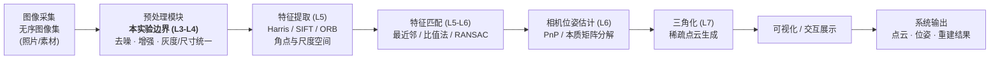

# 系统架构：SFM 数据流图（实验三交付物）

> 软件工程环节：系统架构设计（任务 5）。小组基于项目 I 的增量式三维重建目标，绘制整体数据流图，标注模块边界与数据格式约定。

## 1. 系统数据流图

## 2. 模块输入 / 输出边界

| 模块 | 输入 | 输出 | 所属实验 |
|---|---|---|---|
| 图像采集 | 真实场景 | 无序图像集（JPEG/PNG） | L1 |
| **预处理（本实验）** | **BGR uint8 图像 + 配置 cfg** | **处理后的 BGR uint8 图像** | **L3-L4** |
| 特征提取 | 预处理后图像 | 关键点 + 描述子 | L5 |
| 特征匹配 | 两组描述子 | 匹配对（含外点剔除） | L5-L6 |
| 相机位姿 | 匹配对 + 相机内参 | 相机位姿（R, t） | L6 |
| 三角化 | 匹配对 + 位姿 | 稀疏点云 | L7 |
| 可视化 | 点云 / 位姿 | 三维交互展示 | 阶段 II/III |

## 3. 本实验（预处理模块）边界说明

- 职责范围：噪声去除、图像增强（锐化）、为后续特征提取提供**干净且稳定的输入**。
- 不包含：特征检测、匹配、位姿估计与重建（后续实验负责）。
- 数据格式约定：统一 `uint8`、`BGR` 通道顺序、`(H, W, 3)` 布局；灰度中间结果仅在模块内部使用，对外仍返回 BGR。
- 接口约定：模块统一入口 `preprocess(img_bgr: np.ndarray, cfg: dict) -> np.ndarray`，详见 [interface_agreement.md](interface_agreement.md)。

## 4. 数据格式约定（小组统一）

| 约定项 | 取值 | 说明 |
|---|---|---|
| 像素类型 | uint8 | 0-255，拒绝 16 位/float 直接进入流水线 |
| 通道顺序 | BGR | 与 OpenCV 一致；显示/可视化时转 RGB |
| 数据布局 | (H, W, 3) | 行高列宽，像素访问 img[y, x] |
| 灰度处理 | 内部转换 | 对外仍输出 BGR，保证下游接口稳定 |
| 不修改输入 | 是 | 处理基于副本，原图只读 |

## 5. 关键设计决策

1. 预处理放在流水线最前：噪声会显著影响后续角点检测与匹配质量，必须先降噪。
2. 模块用统一签名 + 配置字典：下游（L4-L7）只依赖 `preprocess(img_bgr, cfg)`，不关心内部算法切换，便于小组并行开发。
3. 评价量化：用 PSNR/SSIM 判断预处理效果，避免"看起来不错"的不可测结论。
