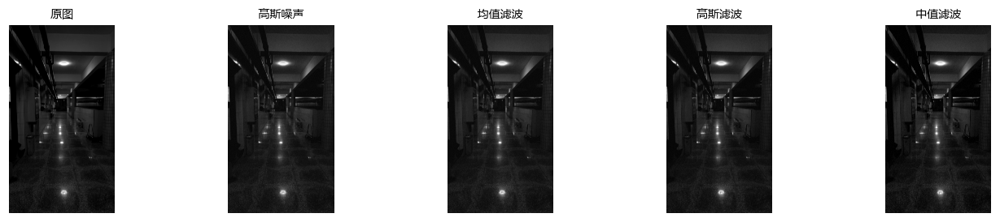
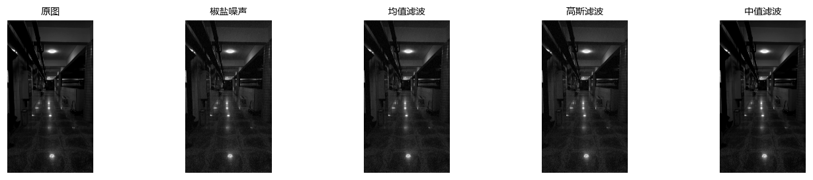
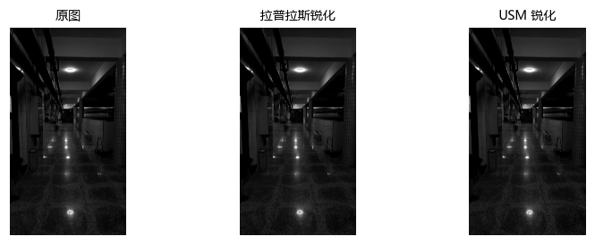
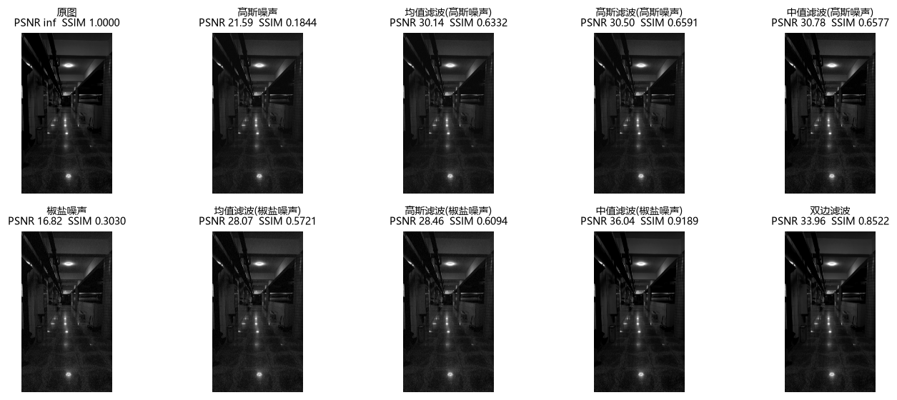

# 实验三报告：空间滤波与图像增强

- 实验人：ScholarWuKong（本机核验）
- 核验日期：2026-09-29
- 对应理论课：T3 灰度变换、直方图与空间滤波
- 代码：`src/lab3_filter.py`；结果：`results/`

## 1. 实验背景与目标

空间滤波是图像增强的核心工具，滤波质量直接决定后续特征提取与匹配的效果，是 SFM 流程"预处理"环节的关键一步。本实验完成：三种经典滤波（均值 / 高斯 / 中值）在两类噪声下的对比、拉普拉斯与 USM 锐化、以及用 PSNR/SSIM 定量评价滤波与增强效果；同时完成系统架构设计（数据流图）与模块接口约定。

## 2. 实验环境

| 项目 | 版本 |
|---|---|
| 操作系统 | Windows 11 (26200) |
| Python | 3.14.1（虚拟环境 `.venv`） |
| opencv-python | 5.0.0.93（cv2.__version__ = 5.0.0） |
| numpy | 2.5.3 |
| scikit-image | 0.26.0（SSIM 用） |
| matplotlib | 3.11.2（对比图绘制） |

输入图像：`data/photo01.jpg`（4096×2304 灰度，室内走廊场景，纹理丰富）。

## 3. 方法与实现

- 噪声模型：高斯噪声 `N(0, 25)`；椒盐噪声 5% 像素随机置 0/255（随机种子 0，可复现）。
- 滤波：均值 `cv2.blur(5)`、高斯 `cv2.GaussianBlur(σ=1.5)`、中值 `cv2.medianBlur(5)`，同一组参数保证可比。
- 锐化：拉普拉斯 `g = f − 0.8·∇²f`；USM `g = 1.6f − 0.6·blur(f)`。
- 评价：PSNR = 10·log₁₀(255²/MSE)；SSIM 由 `skimage.metrics.structural_similarity` 计算。
- 加分项：双边滤波 `cv2.bilateralFilter(d=9, σc=75, σs=75)` 保边去噪。

## 4. 结果与分析

### 4.1 高斯噪声场景：滤波对比

高斯噪声呈均匀"雪花"。三种滤波均明显抑制噪声；高斯滤波与中值滤波在纹理/边缘保留上优于均值滤波，均值滤波边缘更模糊。

### 4.2 椒盐噪声场景：滤波对比

椒盐噪声为黑白散点。中值滤波几乎完全去除椒盐点且边缘保持最好；均值/高斯滤波会残留灰斑——**不同噪声要配不同滤波器**。

### 4.3 锐化对比

拉普拉斯与 USM 均使边缘与纹理更清晰；USM 增强更自然、噪声放大更小，适合作为默认锐化方案。

### 4.4 PSNR / SSIM 评分表（基准 = 原图）

| 图像 / 方法 | PSNR (dB) | SSIM |
|---|---|---|
| 原图 | inf | 1.0000 |
| 高斯噪声 | 21.59 | 0.1844 |
| 均值滤波（高斯噪声） | 30.14 | 0.6332 |
| 高斯滤波（高斯噪声） | 30.50 | 0.6591 |
| 中值滤波（高斯噪声） | 30.78 | 0.6577 |
| 椒盐噪声 | 16.82 | 0.3030 |
| 均值滤波（椒盐噪声） | 28.07 | 0.5721 |
| 高斯滤波（椒盐噪声） | 28.46 | 0.6094 |
| 中值滤波（椒盐噪声） | **36.04** | **0.9189** |
| 双边滤波（加分项） | 33.96 | 0.8522 |

结论：

1. 去噪有效性：高斯噪声下三种滤波后 PSNR 均从 21.6 dB 提升到 30 dB 以上（>28 dB 视为有效），SSIM 从 0.18 提升到 0.63 以上。
2. 噪声-滤波匹配：椒盐噪声下中值滤波 PSNR 36.04 dB / SSIM 0.9189 显著优于均值（28.07/0.57）与高斯（28.46/0.61），验证了中值滤波对脉冲噪声的针对性。
3. 双边滤波（加分项）在未指定噪声类型时取得 33.96 dB / 0.8522，兼顾保边与去噪，适合作为通用预处理备选。

### 4.5 参数选择经验

- **核越大越模糊**：均值滤波没有权重，边缘保持最差；需要保边优先用高斯或中值，或增大 σ 而非盲目加大核尺寸。
- **椒盐噪声必须用中值滤波**：均值/高斯对脉冲噪声几乎无效。
- **拉普拉斯锐化易过冲**：增强系数取 0.8 而非 1.5，且建议先做轻度高斯去噪再锐化；USM 更自然，作为默认。
- **双边滤波参数**：邻域直径 d 取奇数（9），σ_color 控制灰度相似度（过大则退化为高斯），σ_space 控制空间范围。

## 5. 软件工程交付

- 系统架构数据流图与模块边界：[docs/architecture.md](architecture.md)
- 统一接口约定（`preprocess(img_bgr, cfg)`）：[docs/interface_agreement.md](interface_agreement.md)
- 接口落地验证：彩色 BGR 图调用 `preprocess` 返回同尺寸 uint8 BGR，断言通过。

## 6. 结论与局限

- 三种滤波 + 两种噪声场景 + 两类锐化方法完成对比，PSNR/SSIM 量化结论与理论预期一致。
- 局限：photo01.jpg 为单张室内场景，结论对光照不均、纹理稀疏图像需另行验证；SSIM 要求两图同尺寸同 dtype，后续接入 L4 详细设计时需统一输入尺寸。
- 下一实验（L4 边缘检测与分割）将复用本模块的去噪/增强能力，并按本接口约定扩展。

## 7. 提交物清单

| 交付物 | 路径 |
|---|---|
| 源码（含全部函数与主流程） | `src/lab3_filter.py` |
| 滤波 / 锐化 / 评分表结果图 | `results/` |
| PSNR / SSIM 评分表（CSV） | `results/l3_score_table.csv` |
| 架构数据流图 | `docs/architecture.md` |
| 接口约定文档 | `docs/interface_agreement.md` |
| 本报告 | `docs/report.md` |
| 源码压缩包 | `lab3_source.zip` |
